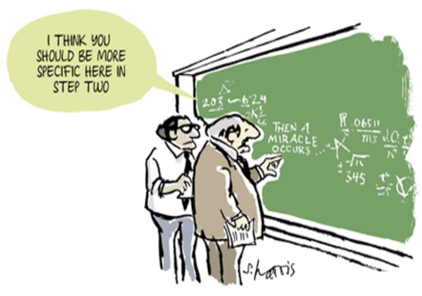

---
output:
  pdf_document: default
  html_document: default
---
# How to Prove It {-}

 

\noindent One of the largest stumbling block in studying mathematics is learning how to prove theorems. In this post, I would share with you 3 of the most commonly used technique with at least one step by step example.

1. Direct proof

\noindent Perhaps the most intuitive and straightforward way to write proofs.  
It goes by "*If A, then B*" or  "*A implies B*" or mathematically A $\Rightarrow$ B.

For example:

  * *The sum of two even numbers is also even.*  
*Proof*: Let $x$ and $y$ be even numbers. Since they are even, by definition they can be rewritten as $2n$ and $2m$ respectively. Thus, the sum $x+y = 2n+2m = 2(n+m)$, which is even number by definition.

  * <a href="https://www.math.utah.edu/online/1010/binom/">*Third Binomial Formula*</a>
\begin{equation}
		(a-b)\cdot (a+b) = a^2-b^2 
\end{equation}  
*Proof*:
\begin{align}
(a-b)\cdot (a+b)&= a\cdot a+a\cdot b-b \cdot a-b \cdot b\\ 
			&= a^2+a \cdot b-b \cdot a-b^2\\ 
			&= a^2-b^2 
\end{align}

  * *Square of odd number is also odd*  
*Proof*: Let $x$ be odd numbers. Since it is odd, by definition it can be rewritten as $2n+1$. Thus the square product $x^2 = (2n+1)^2 = 4n^2+4n+1 = 2(2n^2+2n)+1$ which is an odd number by definition.

***

2. Indirect proof or proof by contradiction

\noindent An elegant way to write a proof that might seem counter intuitive at first. It is also known as proof by contradiction and *reductio ad impossibile*. It goes the following steps:

#. Assume the proposition to be proved is false
#. Then show that the assumption leads to mutually contradictory assertion
#. Since the assumption that the proposition is false proved contradictory, then the proposition must be true

For example:

  * <a href="https://youtu.be/qb75FmAdd0Y">*$\sqrt{2}$ is irrational*</a>  
*Proof*:Let there be $p$ such that $p^2=2$.
If $p$ is rational, we could write $p = \frac{m}{n}$ where $m$ and $n$ are integers that are not both even.
This is then implies that $m^2=2n^2$ and thus $m^2$ is even. If $m^2$ is even, $m$ must be even too. Because $m$ is even, $m^2$ is divisible by 4 which in turn implies that $n^2$ is even and therefore $n$ is even.
This contradicts with our earlier assumption that $m$ and $n$ are integers that are not both even and therefore, a rational $p$ could not exist.

  * *There exist no integers a and b for which $6a + 3b = 1$*  
*Proof*:Let us first assume that such $a$ and $b$ exist.
Dividing by 3 gives us: $2a+b=\frac{1}{3}$
which is a contradiction since $2a+b$ is an integer but $\frac{1}{3}$ is not. Therefore there exist no such integers $a$ and $b$

***

3. Mathematical Induction

\noindent Mathematical induction is usually taught together with series and sequences. It is a powerful tool to prove series and sequences. It is split into two steps:

#. Initial case: prove that the statement holds for 0 and or 1
#. Induction step: assume that if the statement holds for some arbitrary natural number $n$, then prove that it also holds for $n+1$

For example:

  * *[Little Gauss] (Sum of Arithmetic Sequence)*
\begin{equation}
\sum_{i=1}^n i= \frac{n\cdot(n+1)}{2}
\end{equation}
*Proof*:
    - *Initiation step* for $n = 1$:
For the left side:
\begin{equation}
	\sum_{i=1}^n i= 1
\end{equation}
And the right side:
\begin{equation}
	\frac{1\cdot(1+1)}{2}=1
\end{equation}
We obtain the same value from both sides, therefore equation holds for $n = 1$.

    - *Induction step* from $n$ to $n+1$:
    Assume that the statement holds for some arbitrary natural number $n$, then for $n+1$,
For the left side:
\begin{equation}
	\sum_{i=1}^{n+1} i= \frac{(n+1)\cdot(n+2)}{2}
\end{equation}
And the right side:
\begin{align}
	\frac{n\cdot(n+1)}{2}+(n+1) &= \frac{n\cdot(n+1)+2\cdot(n+1)}{2}\\ 
	                            &= \frac{n^2+n+2n+2}{2}\\ 
	                            &= \frac{n^2+3n+2}{2}\\ 
	                            &= \frac{(n+1)\cdot(n+2)}{2}
\end{align}
We obtain the same value from both sides, therefore equation holds for $n+1$. Since both the base case and the induction step have been proved as true, by mathematical induction the statement holds for every natural number $n$.

More examples will be added in the future