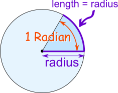
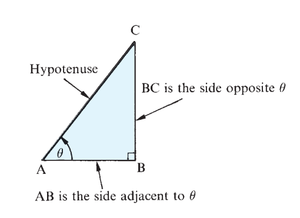
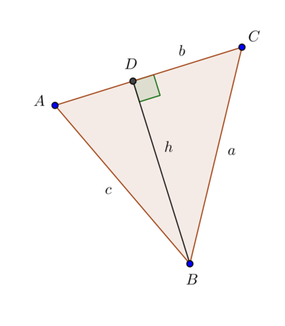

---
output:
  pdf_document: default
  html_document: default
---
#  Introduction to Trigonometry

Reading Materials: \newline
Croft, A. and R. Davidson *Foundation maths.* (Harlow: Pearson, 2016) 6th edition. **Chapter 22 Introduction to trigonometry.**

## Angles

 

An **angle** is the measure of separation between two rays that share a common starting point (vertex).

### Units of Measurement

* **Degrees (°)**:

  * 1 flat angle = 180°
  * 1 complete angle = 360°
  * 1° = 60 minutes (′)
  * 1′ = 60 seconds (″)

* **Radians**:

  * Defined using the arc of a circle:

    \begin{equation}
    1 \text{ radian} = \frac{\text{arc length}}{\text{radius}}
    \end{equation}
  * A complete circle = $2\pi$ radians = 360°

* **Conversion formulas**:

  \begin{equation}
  \text{radians} = \text{degrees} \times \frac{\pi}{180}, \quad 
  \text{degrees} = \text{radians} \times \frac{180}{\pi}
  \end{equation}

### Type of Angles

| **Type of Angle** | **Measure (Degrees)**            | **Measure (Radians)**           | **Notes**                            |
| ----------------- | -------------------------------- | ------------------------------- | ------------------------------------ |
| Acute angle       | $0^\circ < \theta < 90^\circ$    | $0 < \theta < \tfrac{\pi}{2}$   | Smaller than a right angle           |
| Right angle       | $\theta = 90^\circ$              | $\theta = \tfrac{\pi}{2}$       | Quarter turn                         |
| Obtuse angle      | $90^\circ < \theta < 180^\circ$  | $\tfrac{\pi}{2} < \theta < \pi$ | Between right and flat               |
| Flat angle        | $\theta = 180^\circ$             | $\theta = \pi$                  | Straight line                        |
| Reflex angle      | $180^\circ < \theta < 360^\circ$ | $\pi < \theta < 2\pi$           | More than flat, less than full turn  |
| Complete angle    | $\theta = 360^\circ$             | $\theta = 2\pi$                 | Same as $0^\circ$ due to periodicity |

## Triangles

**Definition**

* A **triangle** is a polygon with **three sides** and **three angles**.
* The sum of the interior angles of a triangle is always:

  \begin{equation}
  180^\circ \; \; \text{(or } \pi \text{ radians)}
  \end{equation}

**Classification by Sides**

* **Equilateral**: 3 equal sides, 3 equal angles (each 60°).
* **Isosceles**: 2 equal sides, 2 equal angles.
* **Scalene**: no equal sides, no equal angles.

**Classification by Angles**

* **Acute triangle**: all angles < 90°.
* **Right triangle**: one angle = 90°.
* **Obtuse triangle**: one angle > 90°.

**Exterior Angle Theorem**

* An **exterior angle** of a triangle equals the **sum of the two opposite interior angles**:

  \begin{equation}
  \text{Exterior angle} = \text{Angle}_1 + \text{Angle}_2
  \end{equation}

**Triangle Inequality**

For any triangle with sides $a, b, c$:

\begin{equation}
a + b > c, \quad b + c > a, \quad c + a > b
\end{equation}

* The **sum of the lengths of any two sides** must be **greater than** the third side.
* This condition ensures the three sides can actually form a triangle.

**Special case:**

* If $a + b = c$, the points are **collinear** (they lie on a straight line), so no triangle is formed.

### Special Triangles

**1. Equilateral Triangle**

* All sides are equal: $a = b = c$
* All angles are equal: $60^\circ$ each
* Height formula:

  \begin{equation}
  h = \frac{\sqrt{3}}{2}a
  \end{equation}
* Area:

  \begin{equation}
  A = \frac{\sqrt{3}}{4}a^2
  \end{equation}

**2. Isosceles Triangle**

* Two equal sides: $a = b \neq c$
* Two equal base angles.
* If base = $c$, height from apex bisects base:

  \begin{equation}
  h = \sqrt{a^2 - \left(\frac{c}{2}\right)^2}
  \end{equation}

**3. Right Triangle**

* One angle = $90^\circ$.
* Sides:

  * Hypotenuse = longest side (opposite right angle).
  * Legs = other two sides.
* Area:

  \begin{equation}
  A = \frac{1}{2} \times \text{(base)} \times \text{(height)}
  \end{equation}
* Foundation for **Pythagoras’ Theorem** (next section).

### Similar Triangles

**Definition**

Two triangles are **similar** if they have the same shape but not necessarily the same size.

* Corresponding angles are equal.
* Corresponding sides are proportional.

**Notation**

\begin{equation}
\triangle ABC \sim \triangle DEF
\end{equation}

means $\angle A = \angle D, \; \angle B = \angle E, \; \angle C = \angle F$ and

\begin{equation}
\frac{AB}{DE} = \frac{BC}{EF} = \frac{CA}{FD}
\end{equation}

**Conditions for Similarity**

Two triangles are similar if:

1. **AA (Angle-Angle):** Two pairs of angles are equal.
2. **SSS (Side-Side-Side):** Ratios of all three pairs of sides are equal.
3. **SAS (Side-Angle-Side):** Ratios of two sides are equal and the included angle is equal.

**Property**

* Ratio of areas of two similar triangles equals the **square of the ratio of corresponding sides**:

\begin{equation}
\frac{\text{Area}_1}{\text{Area}_2} = \left(\frac{\text{Side}_1}{\text{Side}_2}\right)^2
\end{equation}

### Pythagoras' Theorem

**Statement**

In a right-angled triangle:

\begin{equation}
a^2 + b^2 = c^2
\end{equation}

* $a, b$ = legs (sides adjacent to right angle)
* $c$ = hypotenuse (side opposite the right angle, longest side)

**Pythagorean Triples**

* Integer solutions to $a^2 + b^2 = c^2$.
* Common examples:

  * (3, 4, 5)
  * (5, 12, 13)
  * (8, 15, 17)
* Multiples also work (e.g., 6, 8, 10).

## Trigonometric Relations

### Basic Ratios (Right Triangles)

For a right triangle with:

* Angle $\theta$
* Opposite side = $O$
* Adjacent side = $A$
* Hypotenuse = $H$

\begin{equation}
\sin \theta = \frac{O}{H}, \quad
\cos \theta = \frac{A}{H}, \quad
\tan \theta = \frac{O}{A}
\end{equation}

**Mnemonic:**
 **SOH-CAH-TOA**

* **S**ine = **O**pposite / **H**ypotenuse
* **C**osine = **A**djacent / **H**ypotenuse
* **T**angent = **O**pposite / **A**djacent

### Law of Sines

\begin{equation}
\frac{a}{\sin A} = \frac{b}{\sin B} = \frac{c}{\sin C}
\end{equation}

*Proof*:

Construct the altitude from $B$.

From the definition of sine:

\begin{equation}
\sin A = \frac{h}{c}, \quad \sin C = \frac{h}{a}
\end{equation}

Thus:

\begin{equation}
h = c \sin A, \quad h = a \sin C
\end{equation}

This gives:

\begin{equation}
c \sin A = a \sin C
\end{equation}

So:

\begin{equation}
\frac{a}{\sin A} = \frac{c}{\sin C}
\end{equation}

Similarly, constructing the altitude from $A$ gives:

\begin{equation}
\frac{b}{\sin B} = \frac{c}{\sin C}
\end{equation}

### Law of Cosines

\begin{equation}
c^2 = a^2 + b^2 - 2ab\cos C
\end{equation}

*Proof*:

Using the same triangle from previous proof, let:

\begin{equation}
e = \text{CD}
\end{equation}

\begin{equation}
f = \text{AD}
\end{equation}

We have that △CDB and △ADB are right triangles.

Hence:

\begin{align}
	c^2 &= h^2+f^2\\ 
	a^2 &= h^2+e^2\\ 
	b^2 &= (e+f)^2\\
	    &= e^2+f^2+2ef\\
	e   &= A \cos C
\end{align}

Then:

\begin{align}
	c^2 &= h^2+f^2\\ 
	    &= a^2-e^2+f^2\\ 
	    &= a^2-e^2+f^2+2e^2-2e^2+2ef-2ef\\
	    &= a^2+\underbrace{(e^2+f^2+2ef)}_{b^2}-2e\underbrace{(e+f)}_b\\
	    &= a^2 + b^2 - 2ab\cos C
\end{align}

### Special Angles (Summary Table)

| Angle      | $\sin \theta$         | $\cos \theta$         | $\tan \theta$         |
| ---------- | --------------------- | --------------------- | --------------------- |
| $0^\circ$  | 0                     | 1                     | 0                     |
| $30^\circ$ | $\tfrac{1}{2}$        | $\tfrac{\sqrt{3}}{2}$ | $\tfrac{1}{\sqrt{3}}$ |
| $45^\circ$ | $\tfrac{1}{\sqrt{2}}$ | $\tfrac{1}{\sqrt{2}}$ | 1                     |
| $60^\circ$ | $\tfrac{\sqrt{3}}{2}$ | $\tfrac{1}{2}$        | $\sqrt{3}$            |
| $90^\circ$ | 1                     | 0                     | undefined ($\infty$)  |
